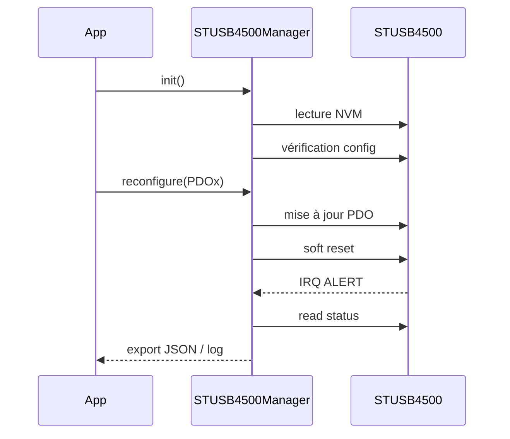

# STUSB4500Manager – Pilote C++ Moderne pour ESP-IDF

> Gestion complète du contrôleur USB-PD **STUSB4500** avec support I2C, NVM, ALERT et configuration automatique.

---

## 🧭 Table des matières

- [Présentation](#présentation)
- [Fonctionnalités principales](#fonctionnalités-principales)
- [Diagramme de séquence](#diagramme-de-séquence)
- [Installation](#installation)
- [Utilisation](#utilisation)
  - [Création de l'instance](#création-de-linstance)
  - [Initialisation du périphérique](#initialisation-du-périphérique)
  - [Lecture de statut](#lecture-de-statut)
  - [Reconfiguration de PDO](#reconfiguration-de-pdo)
  - [Gestion de l'interruption ALERT](#gestion-de-linterruption-alert)
- [Configuration par défaut](#configuration-par-défaut)
- [Licences](#licences)

---

## 📖 Présentation

Cette bibliothèque permet de piloter le **STUSB4500** sur un ESP32 en C++ moderne. Elle encapsule :

- la lecture/écriture des **PDO**,
- la configuration persistante via **NVM**,
- l'écoute des changements via la broche **ALERT** (interruption GPIO),
- la récupération des états USB-PD (status, RDO, CC, VBUS...).

---

## 🔧 Fonctionnalités principales

- ✅ Encapsulation dans `STUSB4500Manager`
- ✅ Intégration avec `I2CDevices`
- ✅ Accès complet aux registres STATUS (JSON ou log)
- ✅ Écriture sélective d’un PDO avec `reconfigure()`
- ✅ Gestion de la configuration persistante (`check_config()`)
- ✅ Support des interruptions GPIO via `handle_alert()`

---

## 🔁 Diagramme de séquence



---

## 🛠️ Installation

Copiez ce composant dans le dossier `components/stusb4500` de votre projet ESP-IDF.

Modifiez votre `CMakeLists.txt` :

```cmake
idf_component_register(
  SRCS ...
  INCLUDE_DIRS "include"
  REQUIRES STUSB4500
)
```

---

## 🚀 Utilisation

### Création de l'instance

```cpp
#include "stusb4500.hpp"
using namespace stusb4500;

I2CDevices i2c(I2C_NUM_0, GPIO_NUM_21, GPIO_NUM_22, 0x28, 400000);
STUSB4500Manager stusb(i2c);
```

### Initialisation du périphérique

```cpp
stusb.init();           // Initialise la config et la tâche interne
stusb.init_device();    // Force la lecture + configuration du STUSB4500
```

### Lecture de statut

```cpp
stusb.get_status(OutputFormat::Log);   // Affiche tous les registres via ESP_LOG
stusb.get_status(OutputFormat::JSON);  // Génère une structure JSON
```

### Reconfiguration de PDO

```cpp
Config new_cfg;
// ... remplissage de la configuration PDO
stusb.reconfigure(1, new_cfg); // Met à jour le PDO1 et force une renégociation
```

### Gestion de l'interruption ALERT

```cpp
gpio_install_isr_service(0);
stusb.handle_alert(); // À appeler depuis le handler d'interruption
```

---


## 🧩 Configuration par défaut

La configuration par défaut du STUSB4500 (PDOs, courants, tensions, fonctions GPIO, etc.) est définie dans le fichier **`Kconfig`**, accessible via le menu `idf.py menuconfig`.

Exemple :

```bash
idf.py menuconfig
 → Component config
   → STUSB4500 Configuration
     → PDO1 Voltage (V)
     → PDO1 Current (mA)
     ...
```

Ces valeurs sont ensuite injectées dans la structure `Config` lors de l’appel à `init_device()`.

---

## 📜 Licences

Code sous licence MIT. Voir [LICENSE](./LICENSE).

---

## 🔮 Améliorations futures

- 🔄 Support du rôle dual
- 📤 Export JSON complet depuis le buffer de logs
- 📦 Intégration avec un bus de messages (MQTT, CAN, etc.)

